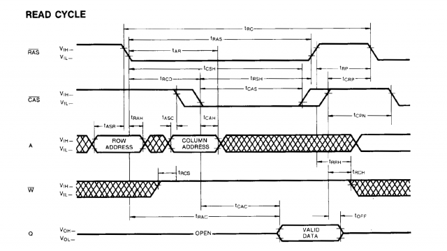
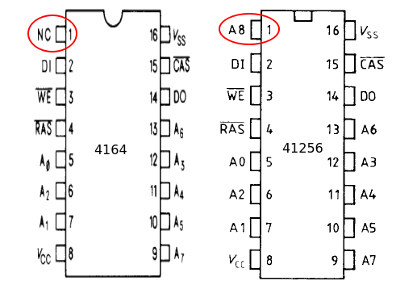

# DramTester
Simple Arduino DRAM tester. It supports up to 9 address lines.
By default it supports 4164.

## Read / Write cycles

### Read Cycle

### Write Cycle

## Arduino Nano connections

### DRAM 4164 / 41256 pinout

### 4164 / 41256
| 4164 / 41256 | Arduino Nano |
|--------------|--------------|
| Din          | D2 (PD2)     |
| Dout         | D3 (PD3)     |
| CAS          | D4 (PD4)     |
| RAS          | D5 (PD5)     |
| Write        | D6 (PD6)     |
| A0           | D8 (PB0)     |
| A1           | D9 (PB1)     |
| A2           | D10 (PB2)    |
| A3           | D11 (PB3)    |
| A4           | D12 (PB4)    |
| A5           | D13 (PB5)    |
| A6           | A0 (PC0)     |
| A7           | A1 (PC1)     |
| A8 (41256)   | A2 (PC2)     |

### Other
| Other        | Arduino Nano |
|--------------|--------------|
| LED Green    | A4 (PC4)     |
| LED Red      | A5 (PC5)     |
| Start Btn    | A5 (PC5)     |

## How to use arduino-cli

Arduino [command line interface](https://create.arduino.cc/projecthub/B45i/getting-started-with-arduino-cli-7652a5).
